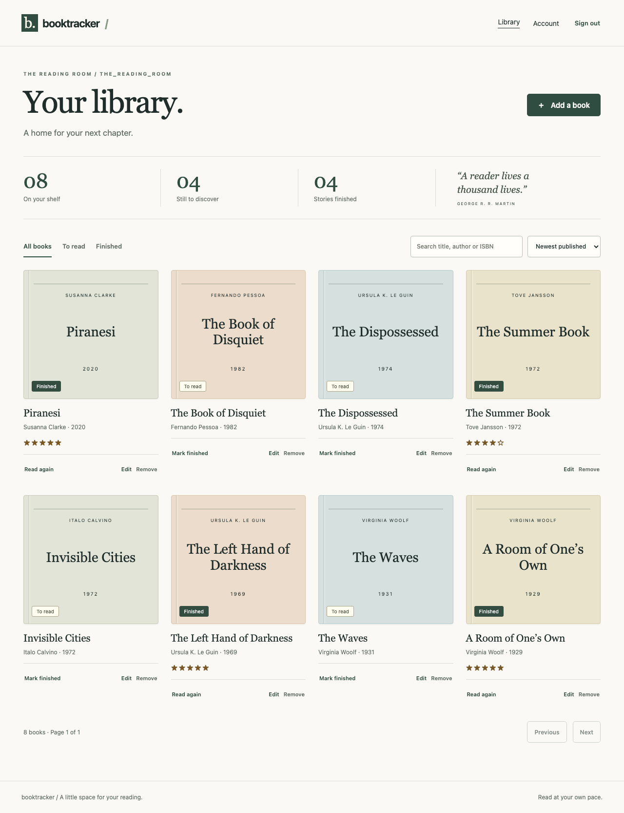
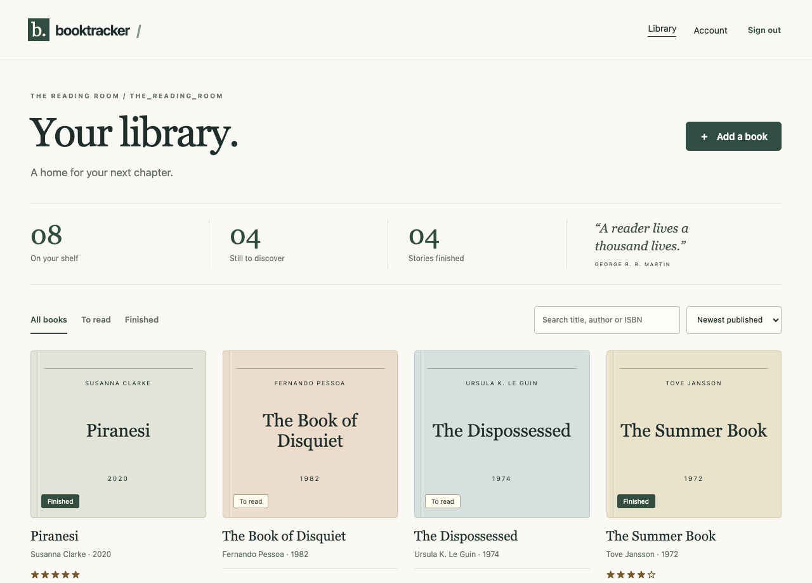

# Booktracker

A quiet place for your reading life. Keep a private bookshelf, track the books you finish, and save the notes you want to return to.

[](https://github.com/fatmakahveci/Django-React-Booktracker/actions/workflows/backend.yml)
[](https://github.com/fatmakahveci/Django-React-Booktracker/actions/workflows/frontend.yml)
[](https://github.com/fatmakahveci/Django-React-Booktracker/actions/workflows/containers.yml)



## Demo



The screenshots use a synthetic local account. [Mobile view](docs/demo/mobile.png) · [Welcome page](docs/demo/landing.png). No public demo host has been provisioned. The Docker setup below runs the complete app and a local mailbox on your machine.

## What it does

- Private bookshelves with add, edit, delete and finished/to-read controls.
- Server-side search by title, author or ISBN, sorting, filters and bounded pagination.
- ISBN validation, optional HTTPS cover images, reading notes, ratings and start/finish dates.
- Email verification, password reset, profile editing, password changes, all-device sign-out and account deletion.
- HttpOnly authentication cookies, CSRF protection, rotating refresh tokens, owner checks and shared Redis authentication limits.
- Responsive layouts, keyboard-accessible dialogs, visible focus, loading/error states and retryable forms.
- OpenAPI documentation, health endpoints, structured logs and optional scrubbed exception reporting.

## Run with Docker

Requirements: Docker Engine/Desktop with Docker Compose, and Python 3 to generate private local credentials.

```sh
git clone https://github.com/fatmakahveci/Django-React-Booktracker.git
cd Django-React-Booktracker
python3 scripts/init-local.py
docker compose build
docker compose up -d --wait postgres redis mailpit
docker compose run --rm api python manage.py migrate --noinput
docker compose up -d --wait
```

Open **http://localhost:8080**. Create an account, open **http://localhost:8025** for the verification email, then follow the link. Mailpit captures local mail; it does not send messages to real recipients. API docs are at **http://localhost:8080/api/docs/**.

`init-local.py` creates `.env` with random credentials and private permissions; it refuses to replace an existing file. Keep `.env` out of Git. PostgreSQL and Redis have persistent Docker volumes. Stop with `docker compose down`; avoid `--volumes` unless you intend to erase local data.

To populate a local demo, set `BOOKTRACKER_DEMO_PASSWORD` to a password of at least 12 characters, then run:

```sh
docker compose run --rm -e BOOKTRACKER_DEMO_PASSWORD api python manage.py seed_demo
```

Sign in as `demo@example.invalid` using that password. Seeding creates eight synthetic books, refuses to overwrite an existing account and is disabled outside development.

## Develop without Docker

Supported runtime matrix: **Python 3.12 / 3.13 / 3.14**, **Node 22.22.2+ / 24.15.0+ / 26**. Main libraries: Django 6.1, DRF 3.18, React 19.3, React Router 7, TypeScript 6.0 and Vite 8. TypeScript 6.0.3 matches the installed ESLint tooling's supported range.

```sh
python3.13 -m venv .venv
source .venv/bin/activate
pip install -r requirements-dev.txt
export DJANGO_DEBUG=true
export DJANGO_DB_PATH=local.sqlite3
export DJANGO_SECRET_KEY="$(python -c 'import secrets; print(secrets.token_urlsafe(64))')"
python manage.py migrate
python manage.py runserver
```

In another terminal:

```sh
cd frontend
npm ci --strict-peer-deps --engine-strict
npm run dev
```

Open **http://localhost:5173**. Vite proxies `/api/` to Django. Local development uses SQLite and prints verification/reset emails in the backend terminal. Use a persistent private signing key in a local environment file or secret store when you want sessions to survive restarts; Django does not automatically load `.env` outside Docker. `DJANGO_DB_PATH` selects a different local database.

## Validate changes

Activate the Python environment and set the development signing key above before running:

```sh
DJANGO_ENV=test python manage.py test
python manage.py makemigrations --check --dry-run
ruff check .
ruff format --check .
DJANGO_ENV=test python manage.py spectacular --file /tmp/openapi.yaml --validate --fail-on-warn
cd frontend
npm run lint
npm run format:check
npm test
npm run build
npx playwright install chromium
npm run test:e2e
```

The backend suite contains 49 tests. PostgreSQL row-lock and Redis integration tests require an isolated `DATABASE_URL` and `REDIS_URL`; SQLite runs skip those three checks. CI runs the complete backend suite on PostgreSQL/Redis across all supported Python versions. Browser tests use temporary databases/mailboxes and test the production build on desktop and mobile Chromium. Never point tests at a live database.

The browser suite covers verified registration, password-reset emails, private cookies, refresh, CRUD, error retries, search/pagination, keyboard focus, responsive overflow and axe accessibility checks. Automated accessibility checks supplement manual testing; they do not establish complete WCAG conformance.

## API

The browser and API share an origin through `/api/`. The standalone Django server exposes the same paths without that prefix.

| Path | Purpose |
| --- | --- |
| `/api/auth/csrf/` | Get the CSRF token for unsafe browser requests |
| `/api/auth/register/`, `/login/`, `/refresh/`, `/logout/` | Browser account/session lifecycle (all under `/api/auth/`) |
| `/api/auth/me/` | Read/update the signed-in profile |
| `/api/auth/password/…`, `/email/…`, `/sessions/revoke/`, `/account/` | Password, verification, session and deletion controls (under `/api/auth/`) |
| `/api/books/` | Owner-scoped CRUD; `search`, `finished`, `year`, `ordering`, `page`, `page_size` |
| `/api/books/summary/` | Total, finished and unfinished counts |
| `/api/schema/`, `/api/docs/` | OpenAPI schema and self-hosted interactive documentation |
| `/api/health/live/`, `/api/health/ready/` | Process and dependency health |

List responses use `{count, next, previous, results}` with 12 items by default and a maximum of 100. Errors include `{error: {code, message, fields}, detail}`. Older bearer endpoints (`/token/`, `/token/refresh/`, `/logout/`, `/register/`) remain available for non-browser clients. See the committed [OpenAPI schema](docs/openapi.yaml) for exact request/response shapes.

## Deploy and operate

Production requires PostgreSQL, Redis, HTTPS, explicit allowed hosts, trusted CSRF origins and a configured SMTP sender. `deploy/compose.production.yaml` adds production settings; `deploy/compose.tls.yaml` optionally supplies Caddy TLS. A host/domain/SMTP provider has not been selected, so public DNS, certificate issuance and external email delivery are intentionally left for deployment validation.

- [Environment and HTTPS configuration](docs/operations/environments.md)
- [Migration, backup, restore and rollback](docs/operations/recovery.md)
- [Health checks, logs and monitoring](docs/operations/observability.md)
- [Architecture and design decisions](docs/ARCHITECTURE.md)
- [All 20 improvement items and verification evidence](docs/PROFESSIONALIZATION.md)

Existing email addresses require verification after upgrading. Take a backup before migrations. The recovery rehearsal restored one synthetic account and eight books into a new PostgreSQL database.

## Security and contribution

Read [SECURITY.md](SECURITY.md) to report vulnerabilities privately and [CONTRIBUTING.md](.github/CONTRIBUTING.md) for the review workflow.

A historical SQLite file is absent from the current tree but remains in older commits and the `v0.1.0` tag. Its scope is documented in the [historical data assessment](docs/security/history-assessment.md). History was not rewritten and historical exposure is not represented as removed.
