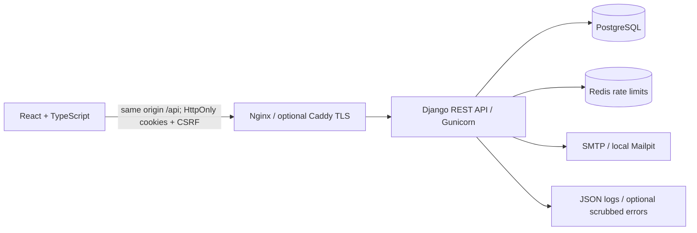

# Architecture and decisions

Booktracker is a private reading library. A user registers, verifies their address, and keeps their own books, notes, dates and ratings. The redesign treats a book as a personal record: every read, update and deletion remains scoped to its owner.

- **Frontend:** routed pages under `frontend/src/pages`, authentication state in `auth`, a typed HTTP client in `api`, reusable dialogs in `components`, shared record types in `types`. Tokens never enter JavaScript storage. Concurrent unauthorized calls share one refresh request. A failed logout retains the signed-in state and asks the user to retry.
- **Backend:** `accounts` owns identities, verification/reset links and session lifecycle; `books` owns reading records and owner-scoped queries. Explicit serializers bound data size and validate years, ISBN checksums, HTTPS covers, ratings and date order. `backend` contains environment selection, health, errors and sanitized request logging.
- **Storage:** PostgreSQL is required in production; SQLite remains useful for isolated local work. A compound user/shelf/year index supports common list queries. Pagination is capped at 100 rows per request, with 12 as the browser default. Existing `finished`/`unfinished` legacy actions retain array responses for older clients.
- **Authentication:** short-lived JWT access cookies and rotating refresh cookies use HttpOnly, SameSite=Lax and production Secure flags. Unsafe cookie requests require CSRF, including login and refresh. Password changes invalidate tokens; a session version invalidates every session without changing the password. PostgreSQL row locks prevent simultaneous reuse of one refresh token. Legacy bearer endpoints remain available for non-browser clients.
- **Email:** single-use links expire after one hour. A reset request returns the same message for unknown accounts. Verification requires an explicit confirmation button so mail scanners do not automatically consume a link. Existing addresses are not silently marked verified during migration.
- **Operations:** development is self-contained in Docker, including a local mailbox. Production adds explicit PostgreSQL/Redis/HTTPS boundaries and provider-independent SMTP settings. Release scripts stop writes before schema migration, and restore always targets a new database.

## Tradeoffs and limits

Authentication rate limits are per IP, so large shared networks may need tuned thresholds. CORS is not a substitute for CSRF. A normal logout revokes refresh and removes cookies; a previously copied access token may remain usable until its five-minute expiry. Password change and **Sign out all devices** invalidate access immediately.

Cover URLs are optional external resources loaded by the browser with `no-referrer`; the server never fetches them. Users should choose trusted image hosts. Books have a simple finished/to-read status, not an invented multi-stage reading state. Email is synchronous with a ten-second timeout; a queue is a future option if measured traffic warrants it.

The deployment configuration is portable; no public host, paid service or monitoring account has been provisioned. Historical database exposure is tracked separately in the [assessment](security/history-assessment.md), not represented as erased.
